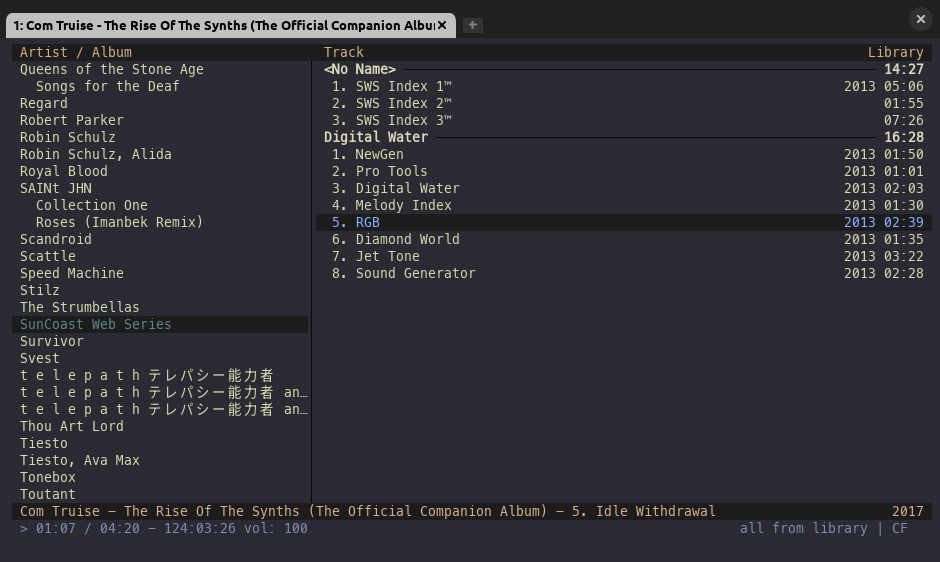

# Kanagawa Theme for cmus

## Use This Theme

- Make sure to put the `kanagawa.theme` file into your `~/.config/cmus` folder
- Run `:colorscheme kanagawa` inside cmus

## Credits

Inspired by the [kanagawa.nvim](https://github.com/rebelot/kanagawa.nvim) theme.

